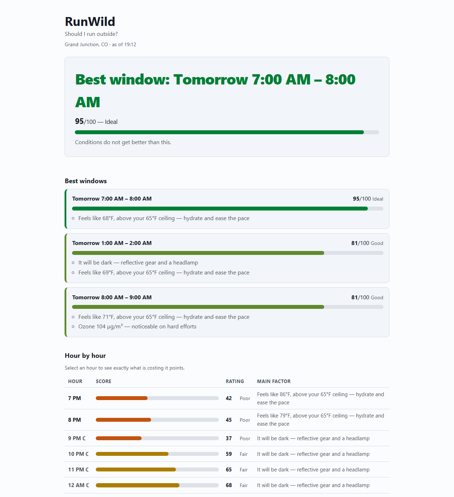
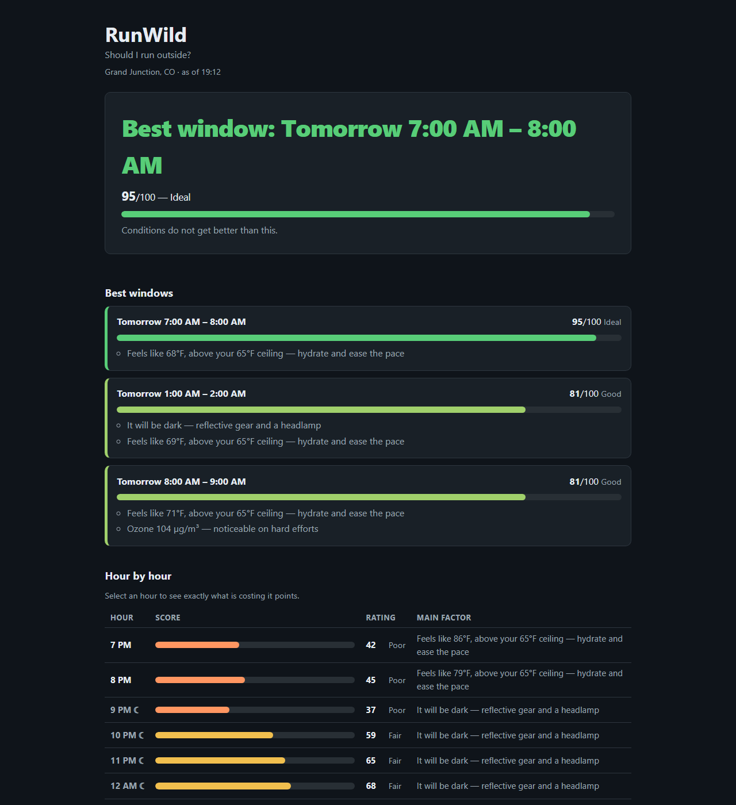

# RunWild — should I run outside?

**A running advisor built on Java 26.** It answers the one question runners actually ask
every morning, using four data sources nobody checks all of, and scores every hour of the
next two days against *your* tolerances rather than a generic comfort index.

> Built for the [Hackster.io **Modern Java in the Wild**](https://www.hackster.io/contests/modern-java-in-the-wild)
> contest — Best Health Solution.

**No API keys. No account. No cloud. $0 to run.** One `mvn package`, one command.

---

## The problem

"Is it actually a good idea to run outside right now?" has at least four inputs:

- **Weather** — but the thermometer lies; 60°F at 90% humidity feels like 80°F
- **Air quality** — a runner moving hard inhales far more of it than the sedentary person
  the AQI bands were written for
- **Ground-level ozone** — peaks with afternoon heat and sunlight, which is exactly when
  people go out, and it is the reason a clear, warm, apparently perfect afternoon burns
  the back of your throat
- **Severe weather alerts** — 72°F and clear is still no time to run under a tornado warning

They live in four different apps, and nobody checks all four. RunWild fetches them
**concurrently over HTTP/3**, scores every hour, and tells you the single best window —
and exactly why the other hours lost points.

## What it looks like

An unedited run, on a genuinely unpleasant August evening in western Colorado
(full capture: [`docs/sample-output.txt`](docs/sample-output.txt)):

```
  RunWild — Grand Junction, CO
  Sunday 2 August, 7:53 PM

  ⓘ Heat Advisory (Moderate) — Heat Advisory issued August 2 at 11:17AM MDT until August…

  BEST WINDOW: TOMORROW 7:00 AM – 8:00 AM
  ████████████████████████  98/100  (Ideal)
  Conditions do not get better than this.

  Best windows
   1. Tomorrow 7:00 AM – 8:00 AM  98/100  (Ideal)
      · Feels like 66°F, above your 65°F ceiling — hydrate and ease the pace
   2. Tomorrow 6:00 AM – 7:00 AM  88/100  (Ideal)
      · It will be dark — reflective gear and a headlamp
   3. Tomorrow 8:00 AM – 9:00 AM  87/100  (Ideal)
      · Feels like 72°F, above your 65°F ceiling — hydrate and ease the pace

  Next 24 hours
   7pm   ██████████··············  42  Feels like 94°F, above your 65°F ceiling — hy…
   10pm  ███████████·············  47  It will be dark — reflective gear and a headl…
   2am   ████████████████████····  84  It will be dark — reflective gear and a headl…
   6am   █████████████████████···  88  It will be dark — reflective gear and a headl…
   7am   ████████████████████████  98  Feels like 66°F, above your 65°F ceiling — hy…
   10am  █████████████···········  53  Feels like 85°F, above your 65°F ceiling — hy…
   1pm   ██████████··············  40  Feels like 101°F, above your 65°F ceiling — h…
   3pm   ██████··················  23  Feels like 98°F, above your 65°F ceiling — hy…
   6pm   ███████·················  29  Feels like 93°F, above your 65°F ceiling — hy…

  3 sources fetched concurrently in 921 ms · HTTP/1.1 · HTTP/1.1 · HTTP/2
  No pollen forecast covers this location, so pollen is excluded from the score.
  Ground-level ozone and the US air-quality index are scored instead.
```

Note what the tool is actually doing there: it rejects the whole afternoon (23/100 at 3pm,
where it feels like 98°F under a Heat Advisory), rates the small hours as merely *good*
because of the darkness safety penalty, and lands on 7am — the one hour that is both light
and cool. That is a different answer from "what is the highest temperature today".

There is also a browser dashboard at `http://localhost:8080` with the verdict, the ranked
windows, an hour-by-hour table, a per-hour score breakdown, and live controls for your
tolerances.





## Architecture

```
                 ┌──────────── StructuredTaskScope (Java 26 preview) ────────────┐
                 │                                                               │
  Config ───────►├─ fork ─ WeatherClient     (Open-Meteo forecast)     ─┐        │
  lat/lon,       ├─ fork ─ AirQualityClient  (Open-Meteo air quality)   ├ HTTP/3 │
  tolerances     └─ fork ─ AlertsClient      (NWS active alerts)       ─┘ client │
                 │         optional: may fail without breaking the plan          │
                 └───────────────────────────┬───────────────────────────────────┘
                                             ▼
                                 merge into List<Hour>   (records, nulls preserved)
                                             ▼
                    Scorer ──► Score(0-100) + List<Advisory>  (sealed interface)
                                             ▼
              WindowFinder ──► Gatherers.windowSliding(runDurationHours)
                                             ▼
                  ┌──────────────────────────┴────────────────────────┐
                  ▼                                                   ▼
        CLI report (--plan)                     JDK HttpServer + browser dashboard
                                                (virtual threads, ScopedValue per request)
```

## Modern Java 26 in this project

Every feature below is here because it was the right tool, not to tick a box. Each links
to the file that uses it.

| Java 26 feature | Where | Why it earns its place |
|---|---|---|
| **HTTP/3 in `HttpClient`** | [`fetch/Http.java`](src/main/java/dev/runwild/fetch/Http.java) | Setting `.version(HTTP_3)` alone is **not enough** — the default `ALT_SVC` discovery silently downgrades the first request. Requests set `HttpOption.H3_DISCOVERY` explicitly, and the protocol *actually negotiated* is reported to the UI. |
| **Structured concurrency** (`StructuredTaskScope`, preview) | [`fetch/DataFetcher.java`](src/main/java/dev/runwild/fetch/DataFetcher.java) | Three independent sources fetched at once: **2.3× faster, measured**. The scope also guarantees no subtask outlives it — if weather fails, the air-quality fetch is cancelled rather than leaked. |
| **Stream Gatherers** (`windowSliding`) | [`score/WindowFinder.java`](src/main/java/dev/runwild/score/WindowFinder.java) | You do not run for an instant, you run for an hour. Finding the best *contiguous block* is literally a sliding window, so it is one stream operation instead of a hand-rolled index loop. |
| **`ScopedValue`** | [`RunContext.java`](src/main/java/dev/runwild/RunContext.java), [`web/WebServer.java`](src/main/java/dev/runwild/web/WebServer.java) | Binds each caller's tolerances for the dynamic extent of one request, so two people can hit the same server and get answers tuned to their own hay fever — with nothing to leak or clean up, unlike a `ThreadLocal`. |
| **Virtual threads** | [`web/WebServer.java`](src/main/java/dev/runwild/web/WebServer.java) | `newVirtualThreadPerTaskExecutor()` on the JDK's own HTTP server. One thread per request, no pool tuning, no framework. |
| **Sealed interfaces + records + exhaustive `switch` with record patterns** | [`model/Advisory.java`](src/main/java/dev/runwild/model/Advisory.java) | Every reason an hour loses points is a record in a sealed hierarchy. Consumers switch with **no `default` branch**, so adding a new advisory is a compile error until every consumer explains it. |
| **Unnamed patterns** (`case Heat _ ->`) | [`model/Advisory.java`](src/main/java/dev/runwild/model/Advisory.java) | Matching on shape where the payload is irrelevant, without inventing unused variable names. |
| **Records throughout** | [`model/`](src/main/java/dev/runwild/model) | The whole domain is immutable data. Boxed types mean *"the source had no value"* stays distinguishable from zero all the way into the scorer. |
| **Text blocks** | [`config/Config.java`](src/main/java/dev/runwild/config/Config.java) | Readable multi-line URL construction. |

### Proof HTTP/3 is real, not decorative

```console
$ java --enable-preview -jar target/runwild.jar --h3-demo
Forcing HTTP/3 (HTTP_3_URI_ONLY, no fallback permitted)
  target: https://cloudflare-quic.com/
  status: 200
  negotiated protocol: HTTP_3
  elapsed: 315 ms
  => HTTP/3 confirmed over QUIC.
```

`HTTP_3_URI_ONLY` **fails outright rather than downgrading**, so a `HTTP_3` result here
cannot be a fallback in disguise.

**Honest caveat:** Open-Meteo does not currently advertise HTTP/3 (no `Alt-Svc` header),
so in practice those two sources negotiate HTTP/1.1 or HTTP/2. RunWild attempts h3 on
every source, falls back cleanly, and **displays the real protocol per source in the
footer**. A dashboard that printed "HTTP/3" while running over HTTP/1.1 would be lying.

### Measured, not asserted

```console
$ java --enable-preview -jar target/runwild.jar --benchmark

Three upstream sources, same data, same machine:
  concurrent (StructuredTaskScope) : 627 ms
  sequential                       : 1440 ms
  speed-up                         : 2.3x
```

### One feature I measured and rejected

The AOT cache (Project Leyden) is an obvious thing to reach for. I measured it over five
runs each — and it made startup **worse**:

| | median startup |
|---|---|
| no cache | **700 ms** |
| `-XX:AOTCache` (12.7 MB) | **1163 ms** |

Loading a 12.7 MB cache costs more than it saves for an application this small, whose
runtime is dominated by network round trips rather than class loading. It is not used.
Reporting that is more useful than a feature list with an unverified claim on it.

## How the score works

Every hour starts at **100** and loses points. Nothing is hidden: the dashboard shows the
itemised deduction for any hour you select.

| Factor | Penalty |
|---|---|
| Apparent temperature | 2 points per °F outside your ideal band, capped at 40 |
| US AQI | ≤50 → 0 · ≤100 → 10 · ≤150 → 30 · ≤200 → 55 · above → 80 |
| Ground-level ozone | <100 µg/m³ → 0 · <140 → 8 · <180 → 18 · above → 30 (EPA 8-hour standard is ~137 µg/m³) |
| Pollen | <10 grains/m³ → 0 · <50 → 8 · <150 → 20 · above → 35, **multiplied by your sensitivity (0–2)** |
| UV index | ≤5 → 0 · ≤7 → 5 · ≤10 → 12 · above → 20 |
| Rain | chance × 0.35, ignored below 20% |
| Wind | (km/h − 15) × 1.2 above 15 km/h, capped at 25 |
| Darkness | 12 — a safety penalty, not a comfort one |
| **Severe weather alert** | **caps the final score at 20**, whatever else is true |

Bands: **Ideal** 85+ · **Good** 70+ · **Fair** 50+ · **Poor** 30+ · **Stay in** below 30.

A window is scored as **70% its average and 30% its worst hour**. Pure averaging happily
recommends a block containing one genuinely miserable hour as long as its neighbours are
pleasant; weighting the worst hour prefers a flat, reliably decent window over a spiky one.

### Missing data is never scored as good data

If a source has no value for a factor, no penalty is applied **and the gap is stated**.
Scoring an unknown AQI as clean air would be confidently wrong.

This matters in practice: **Open-Meteo's pollen model covers Europe only.** US
coordinates return the pollen fields with units but every value is `null` — Grand Junction
returns 0 non-null of 24 hourly values; Berlin returns 24 of 24. So at US locations
RunWild says so plainly and scores **ground-level ozone** instead, which has full US
coverage and is arguably the more relevant respiratory factor for a runner anyway.

## Data sources

All free, all keyless.

| Source | Endpoint | Provides |
|---|---|---|
| Open-Meteo Forecast | `api.open-meteo.com/v1/forecast` | temperature, apparent temperature, humidity, wind, rain, UV, sunrise/sunset |
| Open-Meteo Air Quality | `air-quality-api.open-meteo.com/v1/air-quality` | US AQI, PM2.5, ozone, pollen (Europe only) |
| NWS | `api.weather.gov/alerts/active` | active US watches, warnings, advisories |

NWS **requires a `User-Agent` header** or it returns 403 — that is a documented
requirement of the API, and it is set in `Http.java`.

## Build and run

**Requires JDK 26.** Verify with `java -version` before anything else.

```bash
git clone https://github.com/darcy0408/runwild-java26.git
cd runwild-java26
mvn clean package

# today's recommendation in the terminal
java --enable-preview -jar target/runwild.jar --plan

# the dashboard
java --enable-preview -jar target/runwild.jar --serve
# then open http://localhost:8080
```

On Windows, `run.cmd` wraps this and also sets the console to UTF-8 so the score bars and
degree signs render:

```console
run.cmd --plan
```

### Why `--enable-preview` is required

`StructuredTaskScope` (JEP 505) is **still a preview API in Java 26**, so the flag is
needed at both compile and run time. The build passes it automatically; you only need it
on the `java` command. Everything else RunWild uses — HTTP/3, Gatherers, `ScopedValue`,
virtual threads, record patterns — is final and needs no flag.

### All modes

| Command | Does |
|---|---|
| `--plan` | today's recommendation (default) |
| `--serve [port]` | dashboard on `localhost:8080` |
| `--h3-demo` | prove HTTP/3 is genuinely negotiated |
| `--benchmark` | concurrent vs sequential fetch timing |
| `--version` | runtime, Java version, preview status |

### Configuration

Copy [`runwild.properties.example`](runwild.properties.example) to `runwild.properties`
and set your location and tolerances. Without it, the built-in defaults produce a real
recommendation immediately.

The dashboard also overrides any setting **per request**, so you can change your pollen
sensitivity or temperature ceiling and watch the recommendation move.

## Testing

```console
$ mvn test
Tests run: 26, Failures: 0, Errors: 0, Skipped: 0
```

The fixtures in [`src/test/resources/`](src/test/resources) are **real captured API
responses**, not hand-written samples — so the tests catch upstream shape changes, and
**the whole suite runs with no network**.

Coverage includes: every scoring band; that a severe alert caps an otherwise perfect hour;
that an *expired* or merely *Moderate* alert does not; that pollen sensitivity 0 and 2
produce different answers from identical air; that missing data yields an advisory rather
than a penalty; that the window ranking rejects a spiky block in favour of a flat one; and
that the score is clamped no matter how apocalyptic the inputs.

## Accessibility

Designed in, not retrofitted:

- **Colour never carries meaning alone** — every score is a number *and* a word, so the
  page works in greyscale and for anyone who cannot distinguish the score colours
- The hourly view is a **real `<table>`** with a `<caption>` and row headers, so screen
  readers get the data rather than a picture of it
- Rows are **keyboard operable** — Enter on `keydown`, Space on `keyup`, matching native
  button behaviour
- The verdict is in an **`aria-live`** region, so changing a tolerance is announced
- Skip link, visible `:focus-visible` rings, semantic landmarks, sequential headings
- **Light and dark** via `color-scheme` and `light-dark()`, following the user's system
- `prefers-reduced-motion` and `prefers-contrast` honoured

## Bill of materials

| Item | Cost |
|---|---|
| A laptop or desktop you already own | $0 |
| JDK 26 ([Adoptium Temurin](https://adoptium.net)) | free |
| Internet connection | — |
| API keys / accounts / cloud services | **none** |
| **Total** | **$0** |

Bring-your-own-device: it runs on the machine you already have, and the dashboard is
reachable from your phone on the same network.

## Limitations, honestly

- **NWS alerts are US-only.** Outside the US that source returns nothing and RunWild says
  so; the rest still works.
- **Pollen is Europe-only** upstream, as described above.
- **HTTP/3 depends on the host and network.** Open-Meteo does not advertise it, and some
  proxies and VPNs block QUIC entirely. RunWild always reports the protocol it really got.
- **Scoring thresholds are informed judgement, not clinical guidance.** They follow EPA
  breakpoints where those exist. This is a decision-support tool, not medical advice.
- The forecast horizon is 2 days by default; a run window longer than the remaining
  horizon returns no result rather than a partial one.

## Project layout

```
src/main/java/dev/runwild/
├── Main.java              entry point and CLI modes
├── PlanService.java       fetch → score → rank
├── RunContext.java        ScopedValue holding per-request config
├── config/                Config record, URL construction
├── fetch/                 HTTP/3 client, JSON parsing, StructuredTaskScope fan-out
├── model/                 Hour, Score, Advisory (sealed), RunWindow, Plan, Verdict
├── score/                 Scorer, WindowFinder (Gatherers)
├── cli/                   terminal report
└── web/                   JDK HttpServer, JSON API
src/main/resources/web/    dashboard: index.html, style.css, app.js (no framework)
src/test/                  26 tests + real captured API fixtures
```
